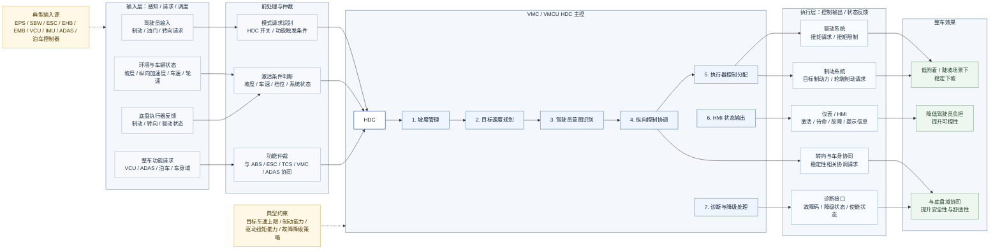

# HDC 系统架构图（可编辑 Mermaid 版本）

```mermaid
flowchart LR

classDef area fill:#f4f7fb,stroke:#8aa4bf,stroke-width:1.5px,color:#1f2d3d;
classDef core fill:#ffffff,stroke:#3f6ea1,stroke-width:1.5px,color:#132238;
classDef fn fill:#eef5ff,stroke:#5b84b1,stroke-width:1.2px,color:#132238;
classDef io fill:#f7f9fc,stroke:#9fb3c8,stroke-width:1px,color:#243447;
classDef note fill:#fff8e7,stroke:#d9b44a,stroke-width:1px,color:#4f3b00;
classDef out fill:#f8fbff,stroke:#87a6c6,stroke-width:1px,color:#203040;
classDef effect fill:#eef7ef,stroke:#73a37c,stroke-width:1px,color:#23422a;

subgraph IN[输入层：感知 / 请求 / 调度]
direction TB
    sensor1[驾驶员输入<br/>制动 / 油门 / 转向请求]
    sensor2[环境与车辆状态<br/>坡度 / 纵向加速度 / 车速 / 轮速]
    sensor3[底盘执行器反馈<br/>制动 / 转向 / 驱动状态]
    sensor4[整车功能请求<br/>VCU / ADAS / 泊车 / 车身域]
end

subgraph PRE[前处理与仲裁]
direction TB
    req[模式请求识别<br/>HDC 开关 / 功能触发条件]
    cond[激活条件判断<br/>坡度 / 车速 / 档位 / 系统状态]
    arb[功能仲裁<br/>与 ABS / ESC / TCS / VMC / ADAS 协同]
end

subgraph CORE[VMC / VMCU HDC 主控]
direction TB
    hdc0[HDC]:::core
    hdc1[1. 坡度管理]:::fn
    hdc2[2. 目标速度规划]:::fn
    hdc3[3. 驾驶员意图识别]:::fn
    hdc4[4. 纵向控制协调]:::fn
    hdc5[5. 执行器控制分配]:::fn
    hdc6[6. HMI 状态输出]:::fn
    hdc7[7. 诊断与降级处理]:::fn
end

subgraph OUT[执行层：控制输出 / 状态反馈]
direction TB
    out1[驱动系统<br/>扭矩请求 / 扭矩限制]:::out
    out2[制动系统<br/>目标制动力 / 轮端制动请求]:::out
    out3[转向与车身协同<br/>稳定性相关协调请求]:::out
    out4[仪表 / HMI<br/>激活 / 待命 / 故障 / 提示信息]:::out
    out5[诊断接口<br/>故障码 / 降级状态 / 使能状态]:::out
end

subgraph VALUE[整车效果]
direction LR
    eff1[低附着 / 陡坡场景下<br/>稳定下坡]:::effect
    eff2[降低驾驶员负担<br/>提升可控性]:::effect
    eff3[与底盘域协同<br/>提升安全性与舒适性]:::effect
end

note1[典型输入源<br/>EPS / SBW / ESC / EHB / EMB / VCU / IMU / ADAS / 泊车控制器]:::note
note2[典型约束<br/>目标车速上限 / 制动能力 / 驱动扭矩能力 / 故障降级策略]:::note

sensor1 --> req
sensor2 --> cond
sensor3 --> cond
sensor4 --> arb
note1 -.-> IN

req --> hdc0
cond --> hdc0
arb --> hdc0
note2 -.-> CORE

hdc0 --> hdc1 --> hdc2 --> hdc3 --> hdc4 --> hdc5
hdc5 --> out1
hdc5 --> out2
hdc4 --> out3
hdc6 --> out4
hdc7 --> out5

out1 --> eff1
out2 --> eff1
out3 --> eff3
out4 --> eff2
out5 --> eff3

class IN,PRE,CORE,OUT,VALUE area;
class sensor1,sensor2,sensor3,sensor4,req,cond,arb io;
```

## 说明

- 该版本基于原图内容重建为 Mermaid 文本，可直接在 Markdown 中编辑。
- 如需更贴近原图排版，可进一步细化为模块级信号流，或转换为 draw.io 版本。

