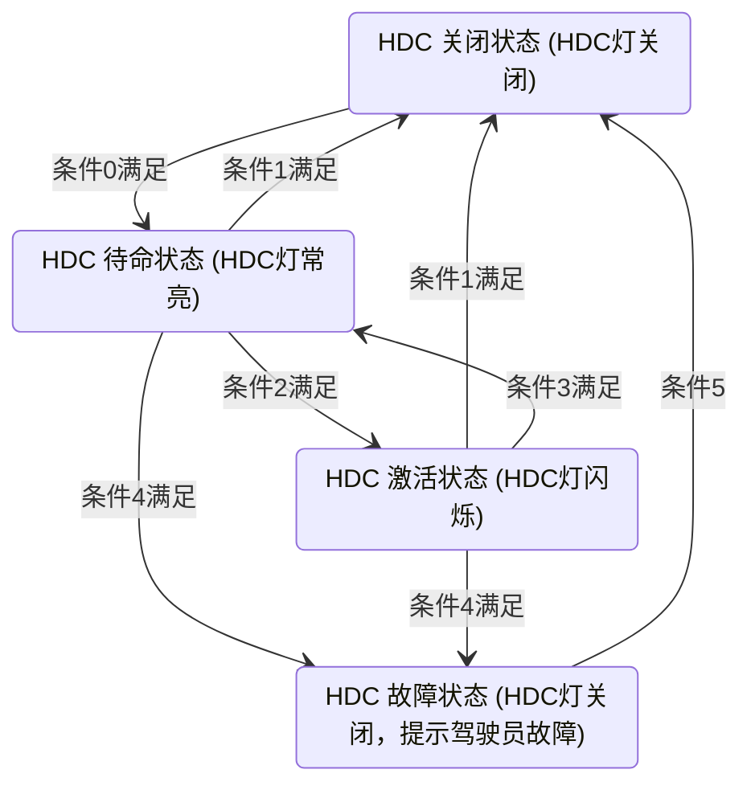

```mermaid

stateDiagram-v2
    state "HDC 关闭状态 (HDC灯关闭)" as OFF
    state "HDC 待命状态 (HDC灯常亮)" as STANDBY
    state "HDC 激活状态 (HDC灯闪烁)" as ACTIVE
    state "HDC 故障状态 (HDC灯关闭，提示驾驶员故障)" as FAILURE

    OFF --> STANDBY: 条件0满足

    STANDBY --> ACTIVE: 条件2满足
    STANDBY --> OFF: 条件1满足
    STANDBY --> FAILURE: 条件4满足

    ACTIVE --> OFF: 条件1满足
    ACTIVE --> FAILURE: 条件4满足
    ACTIVE --> STANDBY: 条件3满足

    FAILURE --> OFF: 条件5

```
