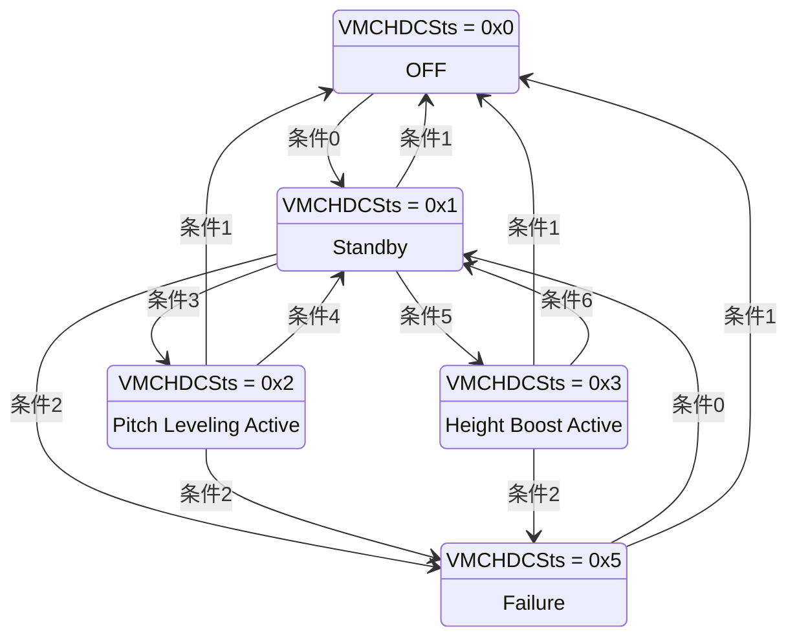

```mermaid


stateDiagram-v2
    

    OFF : VMCHDCSts = 0x0
    OFF : OFF

    Standby : VMCHDCSts = 0x1
    Standby : Standby

    PitchActive : VMCHDCSts = 0x2
    PitchActive : Pitch Leveling Active

    HeightBoostActive : VMCHDCSts = 0x3
    HeightBoostActive : Height Boost Active

    Failure : VMCHDCSts = 0x5
    Failure : Failure

    %% OFF -> Standby
    OFF --> Standby : 条件0
    
    %% failure -> Standby
    Failure --> Standby : 条件0


    %% Any State -> OFF
    Standby --> OFF : 条件1
    PitchActive --> OFF : 条件1
    HeightBoostActive --> OFF : 条件1
    Failure --> OFF : 条件1

    %% Any State -> Failure
    Standby --> Failure : 条件2
    PitchActive --> Failure : 条件2
    HeightBoostActive --> Failure : 条件2


    %% Standby -> Pitch Leveling Active
    Standby --> PitchActive : 条件3

    %% Standby -> HeightBoostActive
    Standby --> HeightBoostActive : 条件5

    %% Pitch Leveling Active -> Standby
    PitchActive --> Standby : 条件4

    %% HeightBoostActive -> Standby
    HeightBoostActive --> Standby : 条件6
```
